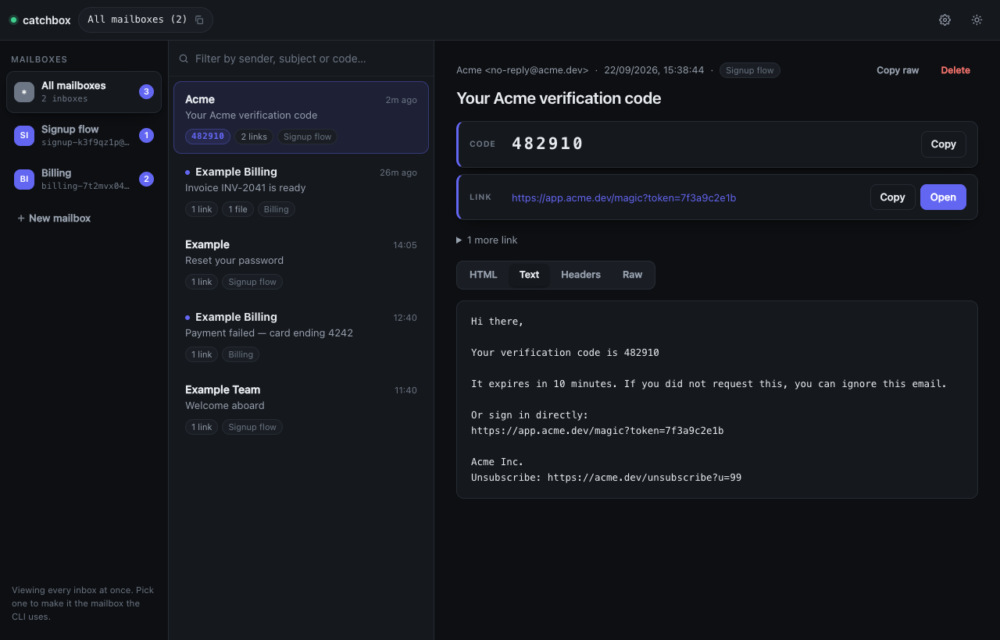
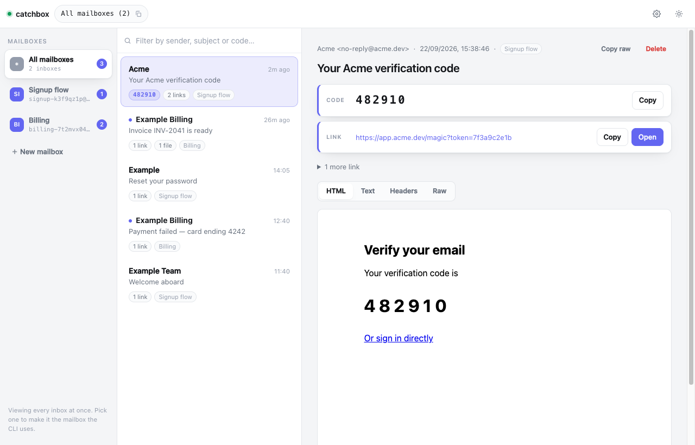
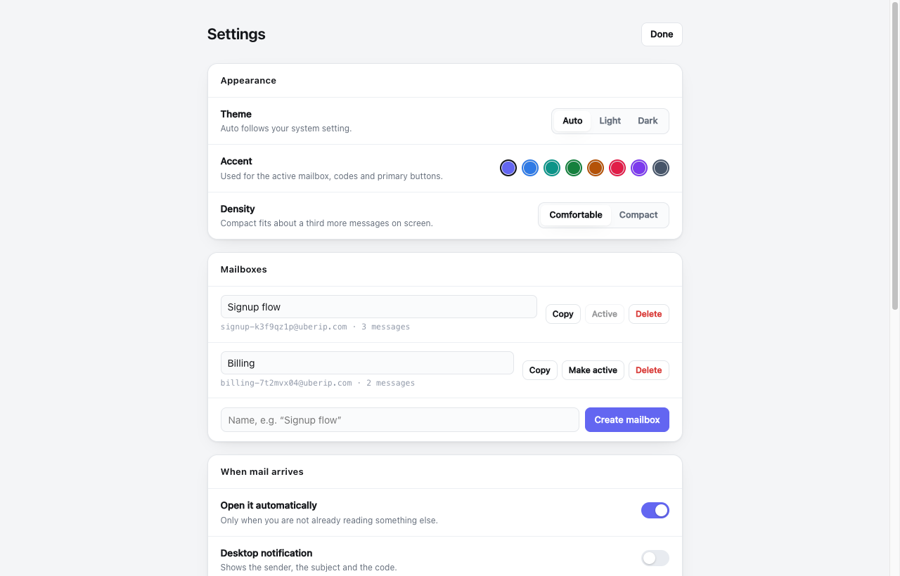

<div align="center">

# catchbox

**Disposable inboxes for developers.** Grab an address, catch the mail, pull out the link or
the code — without leaving your terminal.




</div>

## What this is for

Testing a signup flow means reading an email you don't care about, to copy one thing out of it.
catchbox skips the reading. It hands you the **one-time code** and the **action link**, and
nothing else.

```sh
catchbox                  # signup-k3f9qz1p@uberip.com  (copied)
# …paste that into your signup form…
catchbox code --wait      # 482910  (copied)
```

That's the loop. No browser, no account to make, no shared mailbox that someone else on the
team is also testing against.

## Install

```sh
npm install -g github:brentc22/catchbox
```

Or clone it:

```sh
git clone https://github.com/brentc22/catchbox.git
cd catchbox && npm link
```

Node 18 or newer, and that is the whole list — no dependencies. It talks to
[mail.tm](https://mail.tm) over `fetch` and to nothing else.

The binary installs under both `catchbox` and `testmail`, so scripts and shell aliases from
before the rename keep working.

Curious before you install? `TESTMAIL_DEMO=1 catchbox ui` opens a fixed example inbox that
never touches the network.

## One mailbox per flow

Signup, billing, invites and password resets all send mail, and you want to be able to tell
which is which. So keep a mailbox per flow:

```sh
catchbox add "Signup flow"      # signup-flow-k3f9qz1p@uberip.com  (copied)
catchbox add "Billing"          # billing-7t2mvx04@uberip.com      (copied)

catchbox boxes
# [0]   signup-flow-k3f9qz1p@uberip.com  Signup flow
# [1] * billing-7t2mvx04@uberip.com      Billing

catchbox use "Signup flow"      # every other command now reads that one
catchbox code                   # …the code from the signup mail
```

The name ends up in the address, so you can recognise it in a log line or a signup form
without looking it up.

Need one mailbox while working in another? Don't switch — point a single command at it:

```sh
catchbox list --box Billing
catchbox code --box 1 --wait
```

## The inbox in your browser

```sh
catchbox ui
```

A local inbox on `http://localhost:7337`. Every mailbox is in the sidebar with its own unread
badge, **All mailboxes** merges them into one stream, and new mail appears by itself — it is
pushed, not polled, so there is no refresh interval to sit through.

Each message leads with what you actually came for:

- the **code**, one click from your clipboard;
- the **action link**, with tracking pixels and unsubscribe footers filtered out of the way;
- the **HTML** in a sandboxed frame, so you see the template the way a recipient does;
- the **headers**, read as a deliverability check — DKIM signature, domain alignment,
  plain-text part, `List-Unsubscribe`.

<div align="center">

</div>

Picking a mailbox in the sidebar also makes it the one the CLI reads, so `catchbox code` and
the inbox you are looking at can never drift apart.

### Settings

<div align="center">

</div>

Press <kbd>,</kbd> or click the gear. Light, dark or follow-your-system; an accent colour; a
compact density; and what should happen when mail lands — open it, notify you, beep at you, or
just sit there. Mailboxes are created, named and deleted from the same page.

### Keyboard

| | |
|---|---|
| <kbd>j</kbd> <kbd>k</kbd> | move through the list |
| <kbd>c</kbd> | copy the code |
| <kbd>o</kbd> | open the action link |
| <kbd>y</kbd> | copy the active address |
| <kbd>/</kbd> | filter |
| <kbd>1</kbd>…<kbd>9</kbd> | switch mailbox |
| <kbd>g</kbd> <kbd>a</kbd> | all mailboxes |
| <kbd>,</kbd> | settings |
| <kbd>Esc</kbd> | back |

## Commands

```
catchbox                  show the active address and copy it
catchbox ui [port]        open the inbox in your browser (default 7337)

Mailboxes
  catchbox add [name]     new mailbox, kept alongside the others
  catchbox boxes          list them; * marks the active one
  catchbox use <n|name>   make one active
  catchbox name <text>    name the active mailbox
  catchbox new            replace the active mailbox with a fresh one

Catching mail
  catchbox wait [sec]     block until mail arrives, then print it
  catchbox list           list the inbox
  catchbox show [n]       print message n (0 = newest)
  catchbox open [n]       render message n as HTML in your browser

Pulling things out
  catchbox code           the one-time code, copied to your clipboard
  catchbox link --open    the most likely action link, opened in your browser
  catchbox headers [n]    SPF / DKIM / DMARC and what would hurt deliverability
  catchbox eml [n]        save the raw .eml

Cleaning up
  catchbox rm [n]         delete message n, or the whole mailbox if n is omitted
```

Flags: `--box <n|name|address>`, `--wait [sec]`, `--grace <sec>`, `--json`, `--all`,
`--open`, `--out <file>`.

## In scripts and CI

Every reading command takes `--json`:

```sh
LINK=$(catchbox wait 60 --json | jq -r '.actionableLinks[0]')
curl -sS "$LINK"

CODE=$(catchbox code --wait 60 --json 2>/dev/null || catchbox code --wait 60)
```

`--grace` is there because the obvious script always loses a race: you click something in your
app, *then* start waiting, and the mail has already landed. Anything from the last 90 seconds
still counts, so you don't hang for a minute waiting for a message you already have.

## Why did it land in spam?

```sh
$ catchbox headers
Subject:      Welcome to Acme
From domain:  acme.dev

No Authentication-Results header — this inbox does not verify on receipt.
Checking domain alignment instead, which is what DMARC evaluates:

DKIM signature: acme.dev (selector sel1)
DKIM aligned:   yes
SPF aligned:    NO  (bounces to mail.sendgrid.net — normal via an ESP, DKIM has to carry DMARC)

Plain text part: NO  — HTML-only mail is downranked by iCloud and Outlook
List-Unsubscribe: none
```

A disposable inbox doesn't run SPF or DKIM checks on arrival, so there is no verdict to read.
What the headers still allow is the **alignment** check DMARC itself performs — whether the
signing domain and the bounce domain line up with the `From` domain. That is usually the
answer, and you get it without standing up a real mailbox first.

## How it works

mail.tm provides the mailboxes. catchbox keeps them in
`~/.config/testmail/accounts.json` — the path predates the rename — mints a new token when
one expires, and replaces a mailbox that mail.tm has dropped after a spell of inactivity, so
a command never fails just because you didn't use it for a week.

The active mailbox is also written to the file
[`mailsy`](https://github.com/BalliAsghar/Mailsy) reads, so both tools stay on the same inbox.

## Limits

- **These addresses are public.** Anyone who guesses one can read it. Fine for testing, not
  for anything you mind other people seeing.
- **mail.tm expires idle mailboxes.** catchbox makes you a new one, but the old messages are
  gone.
- **Receive only.** There is no way to send from these addresses.

## Development

```sh
node --test
```

Two things are worth knowing about before you change them:

[`src/extract.js`](src/extract.js) decides which six-digit number in an email is *the code*,
and which of eleven URLs is the one you meant to click. Both are covered by tests, because the
failure mode is silent: a wrong code costs you more than no code, so it returns nothing rather
than guess.

[`src/store.js`](src/store.js) holds the mailboxes. Its tests run against a throwaway `HOME`,
because the thing that would hurt is not a crash — it's a migration that quietly drops a
mailbox you were still using.

## License

MIT
